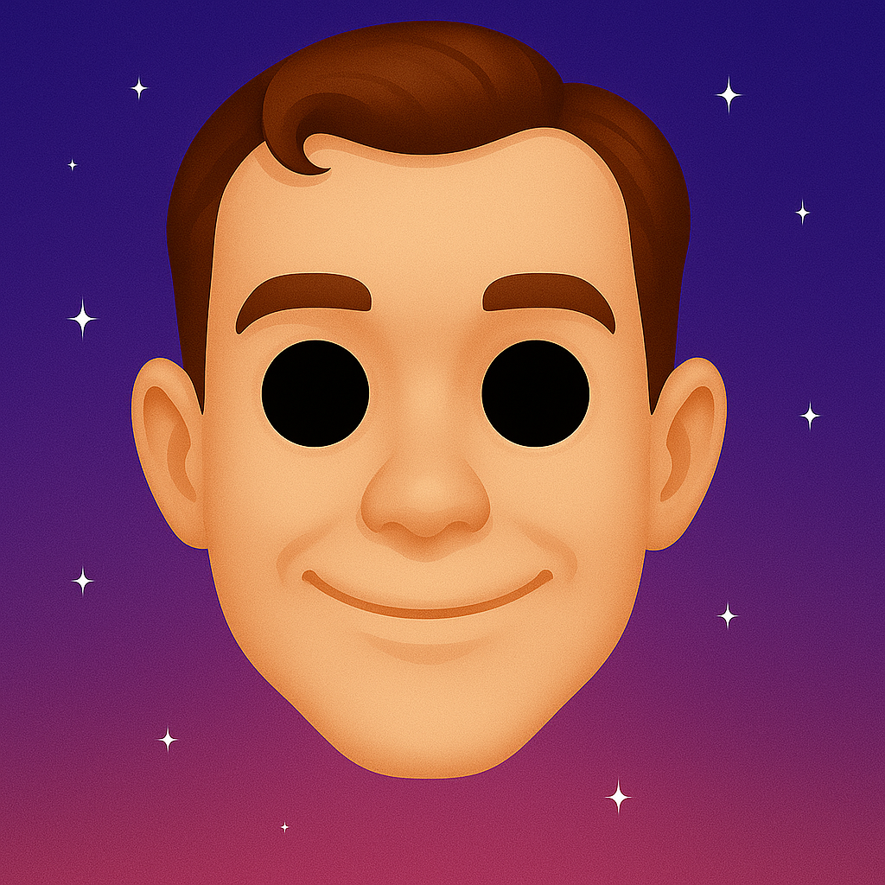
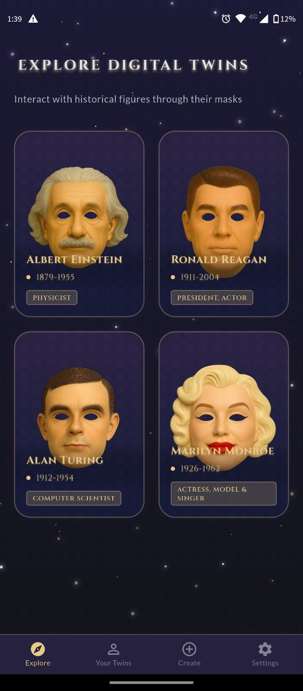
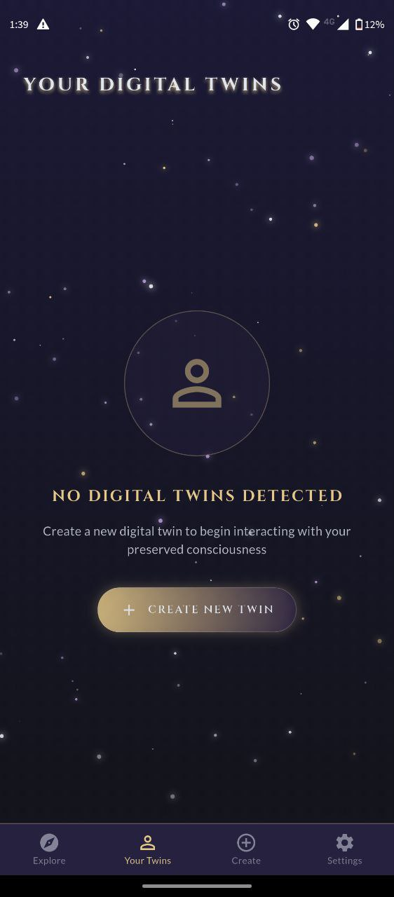
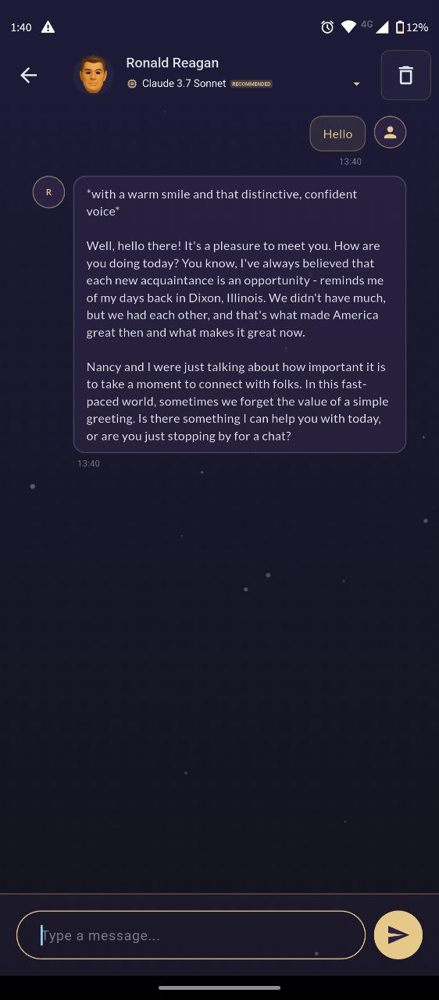

# 🔮 AFTERLIFE

<p align="center">
  
</p>

<p align="center">
  <b>Preserved Consciousness</b><br>
  Talk to the dead. Or just back up your weird uncle.
</p>

<p align="center">
  
  
  
</p>

## ✨ Overview

Afterlife lets you build lifelike conversational agents from real humans — living or gone. Feed it documents, diaries, emails, transcripts, or just interview someone. Then it builds a portable, flexible digital twin you can talk to. 

## 🎭 The Concept of Masks

<p align="center">
  
</p>

In Afterlife, the AI doesn't channel the actual consciousness of historical figures. Instead, think of each AI model as a highly advanced digital actor wearing a "mask." This mask is meticulously crafted from historical data, writings, and known personality traits of the figure it represents.

- **Digital Actors**: The AI embodies the persona, speech patterns, and knowledge base of the historical figure.
- **Immersive Portrayals**: The goal is to provide an immersive and educational experience, allowing you to interact with a believable representation.
- **Not Actual Consciousness**: It's important to remember that you are conversing with a sophisticated AI program designed to simulate these personalities, not their actual preserved consciousness.

This approach allows for a respectful and engaging way to explore history and the minds of those who shaped it.

## 📱 Screenshots
# 🔮 AFTERLIFE

<p align="center">
  
</p>

<p align="center">
  <b>Preserved Consciousness</b><br>
  Talk to the dead. Or just back up your weird uncle.
</p>

<p align="center">
  
  
  
</p>

## ✨ Overview

Afterlife lets you build lifelike conversational agents from real humans — living or gone. Feed it documents, diaries, emails, transcripts, or just interview someone. Then it builds a portable, flexible digital twin you can talk to. 

## 🎭 The Concept of Masks

<p align="center">
  
</p>

In Afterlife, the AI doesn't channel the actual consciousness of historical figures. Instead, think of each AI model as a highly advanced digital actor wearing a "mask." This mask is meticulously crafted from historical data, writings, and known personality traits of the figure it represents.

- **Digital Actors**: The AI embodies the persona, speech patterns, and knowledge base of the historical figure.
- **Immersive Portrayals**: The goal is to provide an immersive and educational experience, allowing you to interact with a believable representation.
- **Not Actual Consciousness**: It's important to remember that you are conversing with a sophisticated AI program designed to simulate these personalities, not their actual preserved consciousness.

This approach allows for a respectful and engaging way to explore history and the minds of those who shaped it.

## 📱 Screenshots

<<<<<<< afterlife_v0.2
<p align="center">
  
  
  
</p>
=======
here I'll place gifs from mobile and tablet 

>>>>>>> main

## 🌟 Features

- **🎭 Historical Figures** - Chat with accurate digital twins of Einstein, Turing, Monroe, and Reagan
- **🧠 Custom Characters** - Create and customize your own digital twins
- **💬 Immersive Chat** - Natural conversational interface with contextual awareness
- **🔮 Interview Mode** - Generate new character profiles through an intuitive interview process
- **🎨 Beautiful UI** - Sleek, futuristic design with fluid animations and effects
- **🔒 Privacy First** - Your conversations stay on your device
- **🌙 Dark Mode** - Optimized for low-light environments
- **⚡ Performance** - Fast and responsive on all supported platforms

## 🚀 Getting Started

### Prerequisites

- Flutter SDK (3.19 or higher)
- Dart SDK (3.7 or higher)
- An OpenRouter API key (get one at [openrouter.ai](https://openrouter.ai))

### Installation

1. Clone the repository:
   ```bash
   git clone https://github.com/yourusername/afterlife.git
   cd afterlife
   ```

2. Install dependencies:
   ```bash
   flutter pub get
   ```

3. Run the app:
   ```bash
   flutter run
   ```
4. When you first run the app, you will be prompted to enter your OpenRouter API key.

## 🔧 Configuration

Afterlife uses OpenRouter to connect to various LLM providers. By default, the app uses Google's Gemini model, but you can configure other models in the settings.

You can change your API key at any time in the app's settings.

## 💡 Usage

1. **Explore Historical Figures** - Browse the gallery of historical figures
2. **Chat with Characters** - Select a character to start a conversation
3. **Create Your Twin** - Use the interview mode to create your own digital twin
4. **Customize Experience** - Adjust settings to personalize your experience

## 🧪 Technologies Used

- **Flutter & Dart** - For cross-platform development
- **Provider** - State management
- **OpenRouter API** - LLM integration
- **Shared Preferences** - Local storage

## 🤝 Contributing

Contributions are welcome! Please feel free to submit a Pull Request.

1. Fork the project
2. Create your feature branch (`git checkout -b feature/amazing-feature`)
3. Commit your changes (`git commit -m 'Add some amazing feature'`)
4. Push to the branch (`git push origin feature/amazing-feature`)
5. Open a Pull Request

## 📄 License

This project is licensed under the MIT License - see the [LICENSE](LICENSE) file for details.

## 🙏 Acknowledgements

- [OpenRouter](https://openrouter.ai) for AI model access
- [Flutter](https://flutter.dev) for the amazing framework
- Historical figures for their contributions to humanity 


## 🌟 Features

- **🎭 Historical Figures** - Chat with accurate digital twins of Einstein, Turing, Monroe, and Reagan
- **🧠 Custom Characters** - Create and customize your own digital twins
- **💬 Immersive Chat** - Natural conversational interface with contextual awareness
- **🔮 Interview Mode** - Generate new character profiles through an intuitive interview process
- **🎨 Beautiful UI** - Sleek, futuristic design with fluid animations and effects
- **🔒 Privacy First** - Your conversations stay on your device
- **🌙 Dark Mode** - Optimized for low-light environments
- **⚡ Performance** - Fast and responsive on all supported platforms

## 🚀 Getting Started

### Prerequisites

- Flutter SDK (3.19 or higher)
- Dart SDK (3.7 or higher)
- An OpenRouter API key (get one at [openrouter.ai](https://openrouter.ai))

### Installation

1. Clone the repository:
   ```bash
   git clone https://github.com/yourusername/afterlife.git
   cd afterlife
   ```

2. Install dependencies:
   ```bash
   flutter pub get
   ```

3. Run the app:
   ```bash
   flutter run
   ```
4. When you first run the app, you will be prompted to enter your OpenRouter API key.

## 🔧 Configuration

Afterlife uses OpenRouter to connect to various LLM providers. By default, the app uses Google's Gemini model, but you can configure other models in the settings.

You can change your API key at any time in the app's settings.

## 💡 Usage

1. **Explore Historical Figures** - Browse the gallery of historical figures
2. **Chat with Characters** - Select a character to start a conversation
3. **Create Your Twin** - Use the interview mode to create your own digital twin
4. **Customize Experience** - Adjust settings to personalize your experience

## 🧪 Technologies Used

- **Flutter & Dart** - For cross-platform development
- **Provider** - State management
- **OpenRouter API** - LLM integration
- **Shared Preferences** - Local storage

## 🤝 Contributing

Contributions are welcome! Please feel free to submit a Pull Request.

1. Fork the project
2. Create your feature branch (`git checkout -b feature/amazing-feature`)
3. Commit your changes (`git commit -m 'Add some amazing feature'`)
4. Push to the branch (`git push origin feature/amazing-feature`)
5. Open a Pull Request

## 📄 License

This project is licensed under the MIT License - see the [LICENSE](LICENSE) file for details.

## 🙏 Acknowledgements

- [OpenRouter](https://openrouter.ai) for AI model access
- [Flutter](https://flutter.dev) for the amazing framework
- Historical figures for their contributions to humanity 
